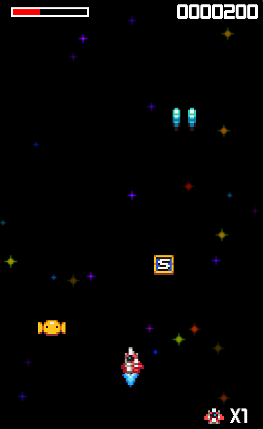

# MiniArc

A retro-style arcade shoot-em-up game that I have created to play around with the SDL3 library. The game is entirely written in C++ and only depends on SDL3 and a few of it's sub-libraries.



## About

MiniArc is a vertical-scrolling space shooter inspired by classic arcade games. Fight waves of alien enemies, collect power-ups, and survive as long as possible.

## Features

- Scrolling starfield background with parallax effect
- Two enemy (planed three) types with distinct behaviors and projectile attacks
- Hold-to-charge weapon mechanic (4x damage)
- Collectible power-ups: health restore, extra ships, weapon enhancement
- Procedurally generated sound effects via [sonar](https://github.com/ByteBender747/sonar)
- Animated sprites and explosion effects
- Score tracking with HUD overlay

## Controls

| Key | Action |
|-----|--------|
| W / S | Move up / down |
| A / D | Move left / right |
| Space | Fire |
| Hold Space | Charge shot (4x damage) |

## Building

### Requirements

- CMake 3.15+
- C++20 compiler
- SDL3
- SDL3\_ttf
- SDL3\_image
- [sonar](https://github.com/ByteBender747/sonar) *(optional — required to regenerate sound effects)*

### Build

```bash
mkdir build
cd build
cmake ..
make
./MiniArc
```

Sound effects are generated automatically during the build if `sonar` is installed. Pre-generated WAV files are included in `Assets/`, so `sonar` is not required for a standard build.

## Project Structure

```
MiniArc/
├── src/          # Game source files
├── inc/          # Game headers
├── sdlc/         # SDL3 utility library
├── Assets/       # Sprites, fonts, audio
├── sfx/          # Sound effect definitions (XML)
└── CMakeLists.txt
```

## License

Source code: MIT License — see [LICENSE](LICENSE)

Pixel art assets: [CC0 1.0 Universal](Mini_Pixel_Pack_License.txt) (public domain)
